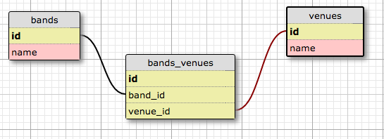

# _Band Tracker_

#### _A web app where a user can track the history of a band's touring career, adding the band to specific venues and vice versa._

#### By _**Adam Craig**_

## Description

_A web app designed with Java that allows a user to utilize a database to create, view, edit, and remove bands. These bands can be assigned to venues to indicate where they have played. Venues can also be assigned to be bands. Bands and venues have a many-to-many relationship, and a join table is used to implement this functionality._

##Database Tables

## Setup/Installation Requirements

* _SETTING UP THE DATABASE AND TEST DATABASE_
* _Clone repository to desktop_
* _Use console to enter directory with all files_
* _In a new console window run the command 'postgres' and keep running_
* _In bash console run the command 'psql band-tracker < band-tracker.sql'_
* _In a new console window run the command 'psql' then 'CREATE DATABASE band-tracker;'_
* _For test database run the command '\c band-tracker' to connect to the database_
* _To create the test database run the command 'CREATE DATABASE band-tracker_test WITH TEMPLATE band-tracker;'_
* _RUNNING THE WEB APP_
* _In console run the command 'gradle run'_
* _Go to http://localhost:4567/_

## Known Bugs

_No known bugs at this time._

## Support and contact details

_For all issues and support, please contact:
Adam Craig at ajcraig@suffolk.edu_

## Technologies Used

_Java, SQL, Spark, Velocity, HTML, CSS, Gradle, JUnit, FluentLenium_

### License

The MIT License (MIT)

Copyright (c) 2016 Adam Craig

Permission is hereby granted, free of charge, to any person obtaining a copy
of this software and associated documentation files (the "Software"), to deal
in the Software without restriction, including without limitation the rights
to use, copy, modify, merge, publish, distribute, sublicense, and/or sell
copies of the Software, and to permit persons to whom the Software is
furnished to do so, subject to the following conditions:

The above copyright notice and this permission notice shall be included in all
copies or substantial portions of the Software.

THE SOFTWARE IS PROVIDED "AS IS", WITHOUT WARRANTY OF ANY KIND, EXPRESS OR
IMPLIED, INCLUDING BUT NOT LIMITED TO THE WARRANTIES OF MERCHANTABILITY,
FITNESS FOR A PARTICULAR PURPOSE AND NONINFRINGEMENT. IN NO EVENT SHALL THE
AUTHORS OR COPYRIGHT HOLDERS BE LIABLE FOR ANY CLAIM, DAMAGES OR OTHER
LIABILITY, WHETHER IN AN ACTION OF CONTRACT, TORT OR OTHERWISE, ARISING FROM,
OUT OF OR IN CONNECTION WITH THE SOFTWARE OR THE USE OR OTHER DEALINGS IN THE
SOFTWARE.
